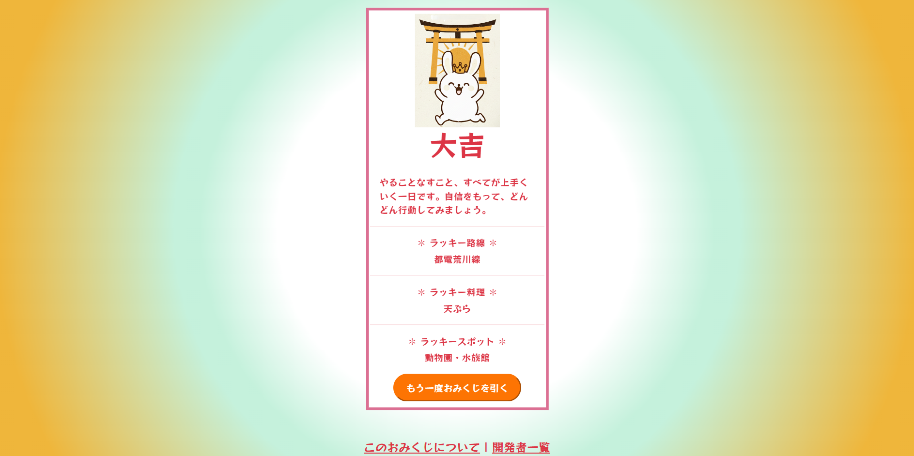

# 運勢占いみくじ

**🔮「今日はどんな運勢？」を気軽にチェックできる、おみくじツールです。** 
ボタンを押すだけで結果（大吉〜凶）と、**ラッキー路線・ラッキー料理・ラッキースポット**をお知らせします。

## [**🧙‍♀️ここから占ってみる🪄**](https://teamd1-yellow.github.io/work-space/)

 

## 主な機能
- ✅ワンクリックでおみくじを引く
- ✅かわいいうさぎが今日の運勢・ラッキー路線・料理・スポットを提案します🐰
- ✅「もう一度おみくじを引く」ボタンで即リトライ♪

## 技術スタック
- HTML
- CSS
- JavaScript

## 開発メンバー💻
- **[chan-malo](https://github.com/chan-malo)**
- **[_sakai](https://github.com/sakai0918)**
- **[hiro1600](https://github.com/nakada-h)**
- **[ohana](https://github.com/r-i55)**

## 使い方(ローカルでの実行)
1. このリポジトリをクローン

2. VSCodeでフォルダを開く
   - VSCodeを起動し、クローンしたディレクトリを開く

3. Live Serverをインストール（未インストールの場合）
   - 拡張機能パネル（Ctrl + Shift + X） を開く
   - 検索バーに `Live Server` と入力し、インストール

4. Live Serverを起動
   - `index.html` を開く
   - 右下の「Go Live」ボタン をクリック

